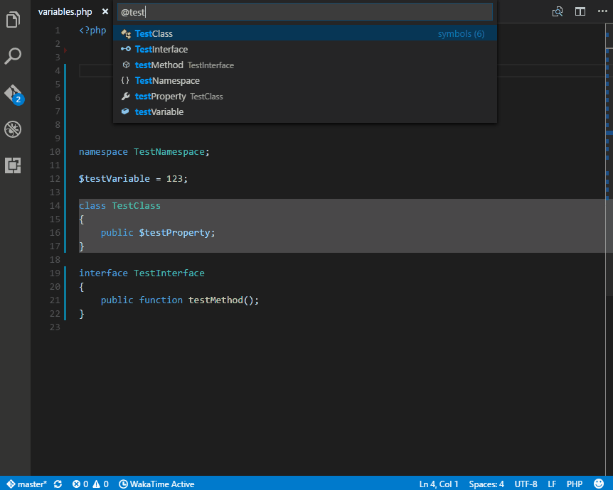

# PHP Language Server

A pure PHP implementation of the [Language Server Protocol](https://github.com/Microsoft/language-server-protocol).

## Used by
 - [vscode-php-intellisense](https://github.com/felixfbecker/vscode-php-intellisense)

## Contributing

You need at least PHP 7.0 and Composer installed.
Clone the repository and run

    composer install

to install dependencies.

Run the tests with 

    vendor/bin/phpunit --bootstrap vendor/autoload.php tests

## Command line arguments

    --tcp host:port

Causes the server to use a tcp connection for communicating with the language client instead of using STDIN/STDOUT.
The server will try to connect to the specified address.

Example:

    php bin/php-language-server.php --tcp 127.0.0.1:12345

